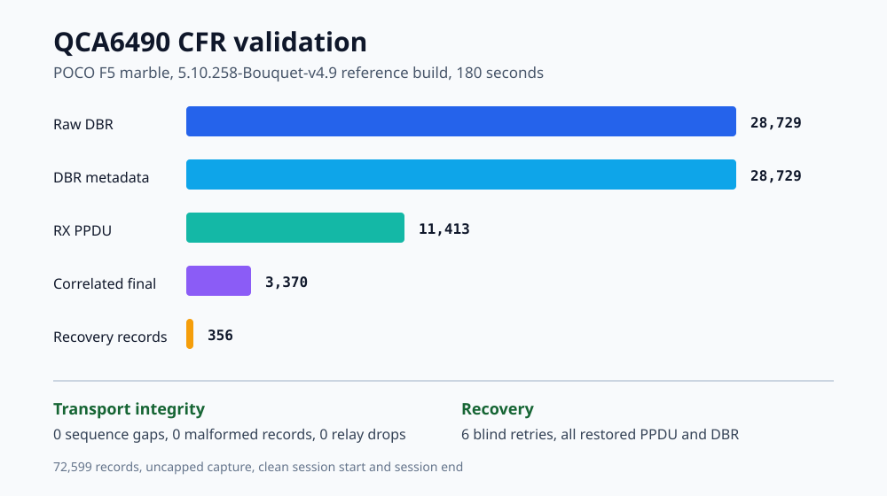

# Marble QCA6490 CFR and CSI research kernel

[](#tested-platform)
[](#tested-platform)
[](#project-status)
[](Documentation/networking/qca6490-cfr.rst)

This branch adds a bounded, loss-observable Channel Frequency Response
transport for the Qualcomm QCA6490 WLAN chipset used by the POCO F5. It is a
kernel research project for reproducible CFR and CSI collection, not a generic
replacement kernel and not a universal flash package.

> [!IMPORTANT]
> The current `CSI/CFR-PATCH` branch is a full sync of the working Bouquet
> research kernel, not a minimal CFR/CSI-only patch series. It intentionally
> includes additional changes that are outside the CFR/CSI WLAN transport, such
> as Gunyah/AVF resource-manager and debug work, GuestVM support scaffolding,
> and lower-level NFC/NCI control and diagnostic changes. Those files are kept
> here to preserve app-facing behavior and source parity with the working
> Bouquet build, but they should be reviewed separately from the CFR/CSI data
> path when assessing risk or rebasing the branch.

> [!WARNING]
> Flashing a custom kernel can prevent boot, break Wi-Fi, or make encrypted
> data permanently inaccessible. Make a complete off-device backup of user
> data, then back up the active boot-related partitions and keep a known-good
> recovery package. This repository does not provide a universal installer.



## Availability and support scope

This repository provides both the `CSI/CFR-PATCH` source branch and the
prebuilt [`marble-bouquet-4.9-csi-r2`](https://github.com/kruonos/android_kernel_xiaomi_marble/releases/tag/marble-bouquet-4.9-csi-r2)
release.

The prebuilt release is intended only for POCO F5 (`marble`) custom ROMs that
support the Bouquet kernel and its module packaging. It is not a universal POCO
F5 kernel, and compatibility with stock HyperOS, unrelated custom ROMs, other
regional firmware packages, or different partition layouts must not be assumed.

- Use the published release only on a ROM that supports the Bouquet kernel.
- Build from source when integrating CFR into an existing verified kernel and
  module packaging flow.
- Do not flash a raw `Image` directly or reuse WLAN modules from another build.
- Back up active-slot `boot`, `vendor_boot`, `dtbo`, and `vendor_dlkm` before
  installation.

This remains a research prototype. Publishing a release makes installation more
accessible, but does not make the kernel universally compatible.

## Why this matters

Qualcomm CFR data normally crosses several asynchronous paths before it is
available to userspace. Raw DBR data, RX PPDU metadata, and the final correlated
capture can arrive at different times. Firmware can also stop producing DBR
events while traffic continues.

This project changes that behavior in five important ways:

1. **Complete-frame relay transport**: every CFRR record is committed in full
   or dropped in full. Partial records are never published.
2. **Raw evidence before correlation**: raw DBR bytes, parsed DBR metadata, and
   RX PPDU evidence are preserved before lookup-table correlation changes state.
3. **Reproducible sessions**: each capture has one session identifier, ordered
   sequence numbers, start configuration, stop reason, and final counters.
4. **Bounded recovery**: soft, hard, and one-time blind recovery stages restart
   stalled QCA6490 capture without replacing the relay file descriptor.
5. **Observable failure**: overload, malformed input, correlation misses,
   recovery attempts, and reader resynchronization are counted explicitly.

The kernel exports CFR evidence. Antenna mapping, RF calibration, phase
correction, channel-matrix construction, and higher-level CSI analysis remain
userspace research tasks.

## Project status

| Area | Status |
| --- | --- |
| Complete CFRR framing | Validated on the 5.10.258 reference build |
| Raw DBR and RX PPDU export | Validated on the 5.10.258 reference build |
| Session start and end records | Validated on the 5.10.258 reference build |
| Soft, hard, and blind recovery | Validated on the 5.10.258 reference build |
| 180 second sustained capture | Passed on the reference build with zero transport gaps |
| No-reader relay exhaustion | Passed with counted complete-frame drops |
| Main-kernel CFRR payload ABI | Source-matched to the validated main tree |
| Current public source version | `5.10.258-Bouquet-v4.9` |
| Prebuilt release | `marble-bouquet-4.9-csi-r2` published |
| Release boot validation | Document tested ROMs and package hashes separately |
| Release sustained CFR validation | Document separately from source-reference validation |
| Physical antenna and lane mapping | Unverified |
| Calibrated CSI reconstruction | Not implemented |
| Other devices and WLAN chipsets | Unsupported |

The full architecture, ABI, controls, and validation record are documented in
[Documentation/networking/qca6490-cfr.rst](Documentation/networking/qca6490-cfr.rst).

## Tested platform

This project has one primary test target. Similar Xiaomi devices are not
implicitly supported.

| Component | Tested value |
| --- | --- |
| Device | POCO F5, codename `marble` |
| SoC family | Qualcomm SM7475, Snapdragon 7+ Gen 2 |
| Wi-Fi chipset | Qualcomm QCA6490 |
| WLAN firmware image | `/vendor/firmware_mnt/image/qca6490/amss20.bin` |
| Vendor and firmware base | HyperOS `OS3.0.4.0.VMRMIXM` global |
| Vendor fingerprint | `POCO/marble_global/marble:15/AQ3A.250226.002/OS3.0.4.0.VMRMIXM:user/release-keys` |
| Active research userspace | Custom `infinity_marble-user`, Android 16, API 36, build ID `BP4A.251205.006` |
| Current source branch build | `5.10.258-Bouquet-v4.9` |
| Published release | `marble-bouquet-4.9-csi-r2` |
| Live reference QCA module hash | `c33b14c6acc5d9f2a19d072c62224fcb5cac661e55b6f4e1b81a2e1f121e8188` |
| Firmware capture-count capability | Not advertised, value `0` |

A published release does not automatically extend validation to every ROM or
vendor firmware combination. Compatibility reports should include complete ROM,
vendor, firmware, kernel, and module identities. The internal WLAN firmware
version string and `amss20.bin` hash were not archived during the original test
run.

## Repository layout

| Path | Purpose |
| --- | --- |
| `Documentation/networking/qca6490-cfr.rst` | Research architecture and ABI reference |
| `tools/qca6490_cfr/cfrr_inspect.py` | Small standalone CFRR capture inspector |
| `tools/qca6490_cfr/test_cfrr_inspect.py` | Inspector unit tests |
| `tools/testing/selftests/net/qca6490_cfr_abi.py` | Golden-byte ABI parity test |
| `wlan_tools/cfr_relay_record.c` | Main-kernel CFRR recorder |
| `wlan_tools/cfr_relay_parse.py` | Main-kernel CFRR parser and analysis tool |
| `wlan_tools/wlan_cfr_probe.c` | WLAN CFR capability probe |
| `drivers/staging/qca-wifi-host-cmn/umac/cfr/` | CFR framing, sessions, and recovery |
| `drivers/staging/qca-wifi-host-cmn/target_if/cfr/` | QCA6490 DBR and RX PPDU handling |
| `drivers/staging/qcacld-3.0/core/hdd/src/wlan_hdd_cfr.c` | Root-only controls and health reporting |

The original Android common-kernel contribution notes are preserved at
[Documentation/process/android-common-kernel-patches.md](Documentation/process/android-common-kernel-patches.md).

## Build

### Prerequisites

The Bouquet build script expects a Linux host and an LLVM toolchain. It uses the
LLVM tools available through `PATH`. When the compiler is installed elsewhere,
set `CLANG_PATH` to the directory containing the LLVM binaries:

```bash
export CLANG_PATH=/path/to/llvm/bin
```

The repository does not download an LLVM toolchain automatically. On x86-64
hosts, the build script also prepends the repository's bundled `build-tools`
directory for supported host-side utilities. Other host architectures must
provide compatible DT and AVB tools through `PATH`.

Common build dependencies include `bc`, `bison`, `build-essential`, `flex`,
`git`, `libelf`, `libssl`, `lld`, `llvm`, `python3`, and standard archive tools.

### Required CFR configuration

The final kernel and WLAN build must provide:

```text
CONFIG_DEBUG_FS=y
CONFIG_RELAY=y
CONFIG_WLAN_CFR_ENABLE=y
CONFIG_WLAN_ENH_CFR_ENABLE=y
CONFIG_WLAN_STREAMFS=y
```

`marble_defconfig` explicitly enables `CONFIG_RELAY=y`. Because WLAN streamfs
depends on both debugfs and relay support, a successful kernel compilation is
not proof that CFR relay capture is enabled.

Verify the generated kernel configuration:

```bash
grep -E '^(CONFIG_DEBUG_FS|CONFIG_RELAY)=y$' out/.config
```

Verify that the Qualcomm WLAN compilation received the expected feature
definitions:

```bash
rg --hidden --no-ignore \
  'WLAN_STREAMFS|WLAN_CFR_ENABLE|WLAN_ENH_CFR_ENABLE' \
  out/drivers/staging/qcacld-3.0
```

A build should not be described as CFR-capable when any of these settings is
absent.

### Compile

```bash
git clone https://github.com/kruonos/android_kernel_xiaomi_marble.git
cd android_kernel_xiaomi_marble
git switch CSI/CFR-PATCH

# Optional when LLVM is not already available through PATH
export CLANG_PATH=/path/to/llvm/bin

./build_bouquet.sh --noccache
```

The default configuration is `marble_defconfig`. The source Makefile and
default local-version settings produce:

```text
5.10.258-Bouquet-v4.9
```

Important outputs include:

```text
out/arch/arm64/boot/Image
out/drivers/staging/qcacld-3.0/qca6490.ko
out/include/config/kernel.release
```

Confirm the exact release string after building:

```bash
cat out/include/config/kernel.release
```

Run the included source and parser tests:

```bash
python3 tools/testing/selftests/net/qca6490_cfr_abi.py
python3 tools/qca6490_cfr/test_cfrr_inspect.py
```

The userspace examples require Python 3.8 or newer and have no third-party
package dependencies.

The golden ABI test checks packed sizes, field declarations, and byte-exact
vectors for the copied main-kernel ABI. A successful source build with streamfs
disabled does not validate the relay implementation, so the final feature flags
must still be inspected.

## Installation and flashing

### Prebuilt release

The prebuilt
[`marble-bouquet-4.9-csi-r2`](https://github.com/kruonos/android_kernel_xiaomi_marble/releases/tag/marble-bouquet-4.9-csi-r2)
release is intended for POCO F5 custom ROMs that support the Bouquet kernel. It
must not be treated as compatible with every POCO F5 ROM, stock HyperOS
installation, regional firmware package, or module layout.

Before flashing, record:

```text
Device codename:
ROM name and version:
ROM fingerprint:
Vendor fingerprint:
Current kernel release:
Active slot:
QCA6490 module path and SHA256:
```

Back up user data and the active-slot `boot`, `vendor_boot`, `dtbo`, and
`vendor_dlkm` partitions. Keep a known-good recovery package off-device.

After booting, verify:

```bash
adb shell uname -a
adb shell su -c 'test -e /sys/kernel/qca6490/cfr_control && echo CFR_CONTROL_OK'
adb shell su -c 'test -e /sys/kernel/qca6490/cfr_status && echo CFR_STATUS_OK'
adb shell su -c 'mount -t debugfs none /sys/kernel/debug 2>/dev/null || true'
adb shell su -c 'ls -la /sys/kernel/debug/cfrwlan0'
```

Successful boot and working Wi-Fi do not by themselves validate the CFR data
path. Run a bounded capture and inspect its framing, session-end record,
sequence gaps, and drop counters before reporting an installation as
CFR-validated.

### Custom source builds

Developers integrating the source branch must package the kernel Image and all
matching modules for the exact ROM, partition layout, module list, boot format,
and symbol ABI.

For the tested HyperOS layout, the WLAN module is installed as:

```text
/vendor_dlkm/lib/modules/qca_cld3_qca6490.ko
```

Do not mix an Image and QCA6490 module produced by different builds. A
mismatched WLAN module can leave the device booted without Wi-Fi, while a
mismatched boot or vendor boot image can prevent startup entirely.

## Capture CFRR data

Root access is required. The example below uses duration mode because the
tested firmware does not advertise capture-count support.

### 1. Prepare debugfs and CFR

```bash
adb shell su -c 'mount -t debugfs none /sys/kernel/debug 2>/dev/null || true'
adb shell su -c 'printf "stop\n" > /sys/kernel/qca6490/cfr_control'
adb shell su -c 'printf "relay_reset\n" > /sys/kernel/qca6490/cfr_control'
adb shell su -c 'printf "clear\n" > /sys/kernel/qca6490/cfr_control'
adb shell su -c 'printf "relay_on\n" > /sys/kernel/qca6490/cfr_control'
adb shell su -c 'printf "window 100000 100000\n" > /sys/kernel/qca6490/cfr_control'
adb shell su -c 'printf "interval_mode duration\n" > /sys/kernel/qca6490/cfr_control'
adb shell su -c 'printf "continuous on\n" > /sys/kernel/qca6490/cfr_control'
adb shell su -c 'printf "watchdog 250 50 75\n" > /sys/kernel/qca6490/cfr_control'
```

Confirm the selected state:

```bash
adb shell su -c 'cat /sys/kernel/qca6490/cfr_status'
adb shell su -c 'cat /sys/kernel/debug/cfrwlan0/continuous'
```

### 2. Open the reader before capture starts

```bash
adb exec-out su -c \
  'cat /sys/kernel/debug/cfrwlan0/cfr_dump0' > capture.cfrr &
READER_PID=$!
```

### 3. Start traffic and capture

`continuous_capture` enables the all-packet filter and has measurable CPU and
latency cost. Use it only in a controlled test environment.

```bash
adb shell su -c \
  'printf "continuous_capture\n" > /sys/kernel/qca6490/cfr_control'

# Generate the traffic required by the experiment, then stop after the chosen
# interval.
sleep 30

adb shell su -c 'printf "stop\n" > /sys/kernel/qca6490/cfr_control'
sleep 1
kill "$READER_PID" 2>/dev/null || true
adb shell su -c 'printf "relay_off\n" > /sys/kernel/qca6490/cfr_control'
```

Validate the file immediately. The inspector exits nonzero when the capture is
missing a matching session start or session end, contains a sequence gap, or
contains malformed framing:

```bash
python3 tools/qca6490_cfr/cfrr_inspect.py capture.cfrr
```

Use `--allow-incomplete` only for an intentional rotated segment whose session
boundaries are stored in adjacent files.

If ADB or the reader disconnects while capture continues, the fixed relay will
eventually fill and begin dropping complete records. Stop the experiment and
inspect `relay_stats` before treating the file as valid evidence.

## Inspect and decode CFRR metadata

The included inspector validates framing and summarizes sessions, sequence
gaps, record types, DBR metadata, RX PPDU evidence, recovery stages, and final
counters:

```bash
python3 tools/qca6490_cfr/cfrr_inspect.py capture.cfrr --records 3
```

JSON output is available for notebooks and analysis pipelines:

```bash
python3 tools/qca6490_cfr/cfrr_inspect.py capture.cfrr --json \
  > capture.summary.json
```

Expected summary shape from the 180 second validation run:

```text
records: 72599
bytes: 79875376
types: {"dbr_meta": 28729, "final": 3370, "raw_dbr": 28729,
        "rearm": 356, "rx_ppdu": 11413, "session_end": 1,
        "session_start": 1}
sequence_gaps: 0
invalid_headers: 0
invalid_payloads: 0
lifecycle_errors: 0
counter_mismatches: 0
rearms: {"blind": 6, "hard": 175, "soft": 175}
rearm_failures: 0
session_end: {"records_committed": 72599, "records_dropped": 0, ...}
```

The example inspector does not convert raw samples into calibrated CSI. It is
deliberately small and focuses on transport integrity. The exact payload ABI,
DBR metadata fields, and reader requirements are documented in the
[CFR transport reference](Documentation/networking/qca6490-cfr.rst).

## Validation evidence

Two uncapped device tests are documented:

- 75 seconds, 34,132 records, one blind recovery, zero sequence gaps
- 180 seconds, 72,599 records, six blind recoveries, zero sequence gaps

Every blind recovery restored both PPDU and DBR evidence. A separate no-reader
test filled the 4 MiB relay and produced 17,894 counted complete-frame drops
without malformed records.

Under one 400-packet ICMP workload, active all-packet CFR increased average RTT
from 23.242 ms to 55.695 ms and whole-device CPU busy time from about 6.31
percent to 29.02 percent. These values describe one test setup and are not a
general performance guarantee.

## Known limitations

- The prebuilt release is intended only for compatible Bouquet-based POCO F5
  custom ROMs.
- Release-package boot validation and sustained CFR transport validation should
  be reported separately.
- The tested WLAN firmware reports no capture-count support. Duration mode and
  host recovery are required.
- The internal `amss20.bin` firmware version string and file hash were not
  archived during the original run.
- The 32 KiB frame limit is specific to this Marble QCA6490 experiment.
- Physical antenna mapping, lane calibration, phase correction, and full CSI
  reconstruction are not implemented.
- The example inspector validates CFRR framing and metadata but does not decode
  calibrated complex CSI samples.
- Optional vendor netlink duplication is not intended for sustained high-rate
  capture.
- Other devices, regional firmware packages, QCA chipsets, and 5.15 kernels are
  unverified.
- Generic relayfs users outside this CFR channel have not received a dedicated
  regression suite for this patch.

## Data safety and research ethics

CFR and CSI can reveal properties of radio traffic and the surrounding
environment. Collect data only from networks and devices where the operator
has authorization. Treat raw captures as sensitive research data.

Every published result should include:

- device model and codename
- ROM and vendor fingerprints
- WLAN firmware path, version, and hash when available
- kernel release and commit
- QCA6490 module hash
- complete capture configuration
- CFRR file hash and parser version
- sequence-gap, drop, malformed-record, and recovery counters

Do not upload raw captures containing third-party traffic without a documented
consent and redaction process.

## Contributing and reporting results

Issues and pull requests are welcome when they include enough information to
reproduce the result.

For a bug report, provide:

```text
Device and codename:
ROM fingerprint:
Vendor fingerprint:
WLAN firmware path and version:
Kernel release and commit:
QCA module SHA256:
Capture mode and window:
Traffic workload:
Session duration:
Record counts:
Sequence gaps and drops:
Soft, hard, and blind recovery counts:
First relevant kernel warning or error:
```

Useful contributions include:

- verified support reports for another Marble firmware build
- CFRR parser tests and fuzz cases
- maximum-record relay latency measurements
- correlation and unmatched-raw analysis
- documented lane and antenna mapping experiments
- lower-overhead capture profiles

Keep patches focused, preserve the bounded-memory design, and include a test or
capture result for behavior changes. Safety-critical thermal, PMIC, regulator,
storage, and partition changes are outside the scope of this project.

## License

Kernel changes follow the licensing of their source files and the Linux kernel
GPL-2.0 license. Userspace examples in `tools/qca6490_cfr` are GPL-2.0.
